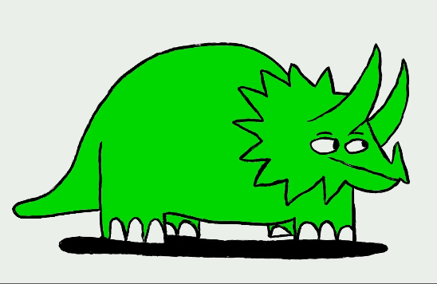

# Proyecto de Grid Layouts con Flexbox y CSS Grid

Este proyecto presenta un diseño de grids utilizando Flexbox y CSS Grid. Se muestra una estructura de imágenes organizadas en dos contenedores flexibles, cada uno con su propio conjunto de elementos de imagen. El diseño está centrado en mostrar imágenes de manera estilizada y adaptable.

## Descripción

El archivo `index.html` contiene la estructura del proyecto, mientras que el archivo `index.css` proporciona el estilo para los contenedores y elementos dentro del diseño. Se utilizan dos contenedores principales para organizar las imágenes:

- **Flexbox Container 1:** Un contenedor principal que utiliza Flexbox para organizar las imágenes en un diseño flexible y responsivo.
- **Grid Container 1 y Grid Container 2:** Estos contenedores emplean CSS Grid para distribuir las imágenes en un formato de cuadrícula.

## Estructura de Archivos


## HTML: Estructura

El HTML define dos flex-containers principales (`.flex-container` y `.flex-container2`), cada uno con su propia configuración de grid. Dentro de estos contenedores, se incluyen varias imágenes que se posicionan de manera específica utilizando propiedades CSS.

### Código HTML
```html
<!DOCTYPE html>
<html lang="en">
<head>
    <meta charset="UTF-8">
    <meta name="viewport" content="width=device-width, initial-scale=1.0">
    <title>Grids</title>
    <link rel="stylesheet" href="./index.css">
</head>
<body bgcolor="#0f1323">
    
    <div class="flex-container">
        <div class="grid-container">
            
            
            
            
        </div>
    </div>

    <div class="flex-container2">
        <div class="grid-container">
            
            
            
        </div>
    </div>
</body>
</html>


Este `README.md` proporciona una descripción general de la estructura, el código y cómo usar el proyecto. También incluye detalles sobre cómo contribuir y licencias, en caso de que sea necesario.
